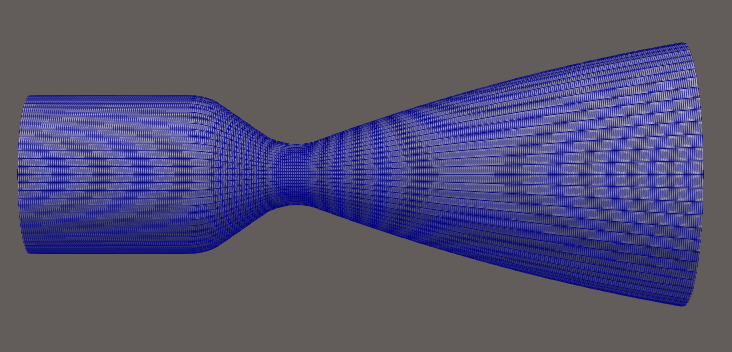
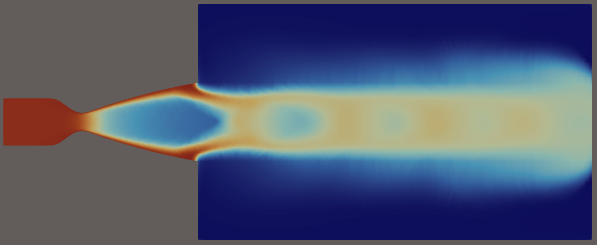
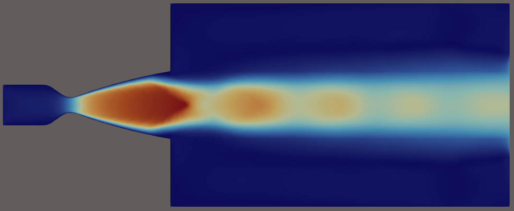
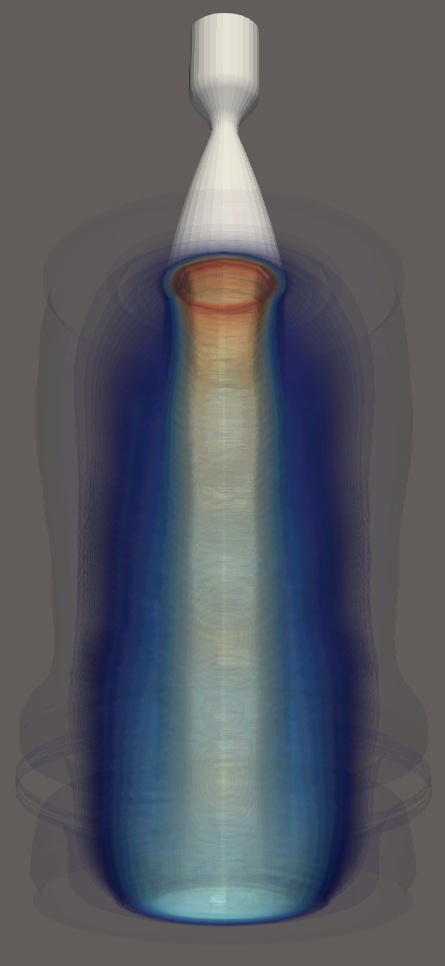

<div align="center">
<pre>
██████╗ ██████╗  █████╗  ██████╗  ██████╗ ███╗   ██╗    ██╗██╗
██╔══██╗██╔══██╗██╔══██╗██╔════╝ ██╔═══██╗████╗  ██║    ██║██║
██║  ██║██████╔╝███████║██║  ███╗██║   ██║██╔██╗ ██║    ██║██║
██║  ██║██╔══██╗██╔══██║██║   ██║██║   ██║██║╚██╗██║    ██║██║
██████╔╝██║  ██║██║  ██║╚██████╔╝╚██████╔╝██║ ╚████║    ██║██║
╚═════╝ ╚═╝  ╚═╝╚═╝  ╚═╝ ╚═════╝  ╚═════╝ ╚═╝  ╚═══╝    ╚═╝╚═╝

                 ╔═╗╔═╗╔╦╗╔╗ ╦ ╦╔═╗╔╦╗╦╔═╗╔╗╔
                 ║  ║ ║║║║╠╩╗║ ║╚═╗ ║ ║║ ║║║║
                 ╚═╝╚═╝╩ ╩╚═╝╚═╝╚═╝ ╩ ╩╚═╝╝╚╝
</pre>
</div>

# DRAGON II Combustion - Experimental CUDA Navier-Stokes Solver with Frozen Chemistry model - in development

## Description
This project implements a Frozen Chemistry model inside the solver Dragon 2. The goal
is to simulate the combustion with a RD-107 rocket engine (kerosene and liquid oxygen), in dimension 3, with a DNS solver. 

## Key Concepts
The approach followed here is to transfer the entire computation on the GPU to offer maximal speed.

## Remarks
- Navier-Stokes DNS solver with Frozen Chemistry model
- Single GPU computation
- This project uses the data from the project https://github.com/AndyShor/RD_107.gitfor, for the description of the geometry of the engine and the fractions of the chemical species.

## Supported OS
Tested on Ubuntu 24.04

## Prerequisites
Tested with Nvidia RTX 4000 and RTX 5000 generation cards

## Build and run

### Build with:
```bash
cd build/
cmake ..
make
```

### Then run with:
```bash
./solver_ns
```

### - These are extracts of transcient simulations, made with about 2.25 Million elements (Q1) -

##### mesh with dealii:



#### 2d cut of the three-dimensional simulation (resp. T and Mach):




#### 3d contour of T:




